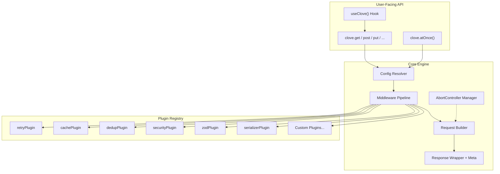
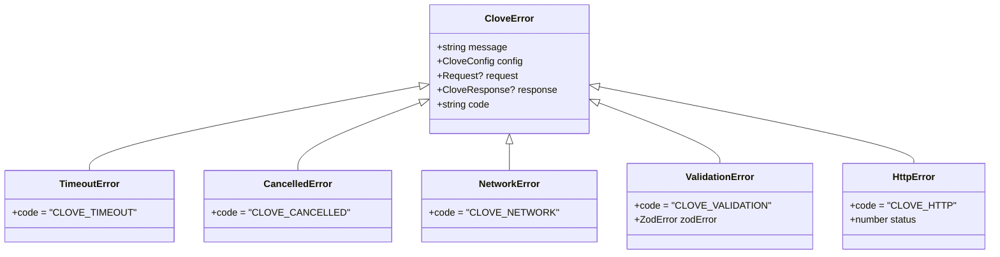
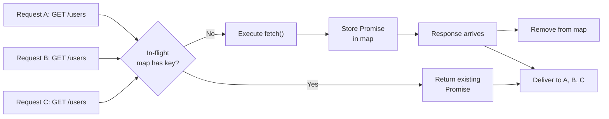
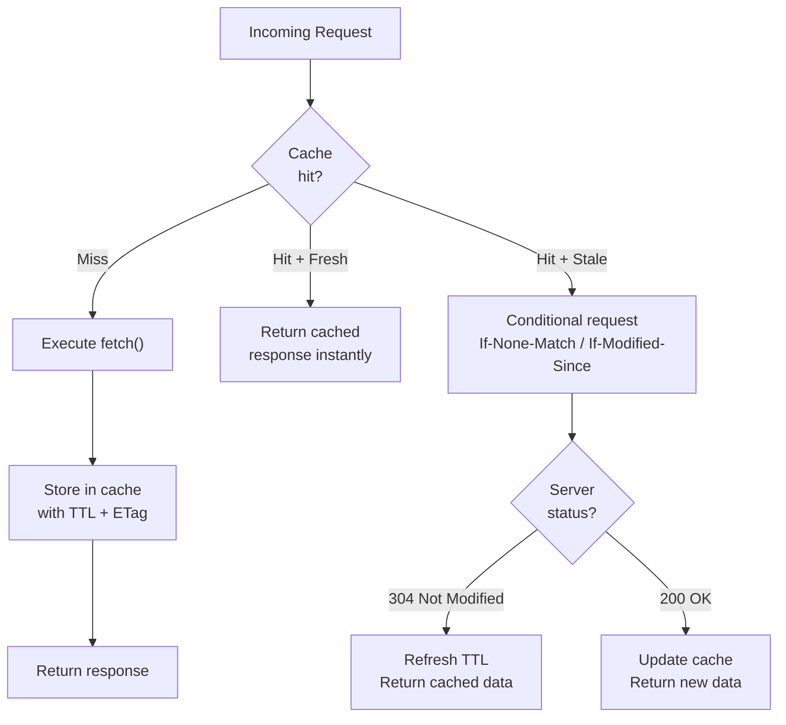

# 🌿 Clove — Implementation Plan

> A modular, plugin-based fetch API wrapper built on web standards.

---

## Table of Contents

1. [Architecture Overview](#1-architecture-overview)
2. [Project Structure](#2-project-structure)
3. [Core Engine Design](#3-core-engine-design)
4. [Plugin System](#4-plugin-system)
5. [Built-in Plugins](#5-built-in-plugins)
6. [Caching & Deduplication Strategy](#6-caching--deduplication-strategy)
7. [Security Hardening](#7-security-hardening)
8. [React Integration](#8-react-integration)
9. [API Surface & Usage Examples](#9-api-surface--usage-examples)
10. [Implementation Phases](#10-implementation-phases)
11. [Tooling & Build](#11-tooling--build)

---

## 1. Architecture Overview

Clove is built as a **layered onion architecture** where every feature beyond the raw fetch call is either core infrastructure or a removable plugin.



### Design Principles

| Principle | How It's Applied |
|---|---|
| **Zero required plugins** | Core works standalone — plugins only enhance |
| **Plugin order matters** | `beforeRequest` hooks run in registration order, `afterResponse` in reverse |
| **Type safety first** | Full TypeScript, generics on responses, Zod integration |
| **Tree-shakeable** | Unused plugins aren't bundled if using ESM imports |
| **Framework agnostic core** | React hook is a separate entry point (`clove/react`) |

---

## 2. Project Structure

```
clove/
├── src/
│   ├── core/
│   │   ├── client.ts              # CloveClient class — main entry
│   │   ├── config.ts              # Config types, defaults, merge logic
│   │   ├── request.ts             # Request building & fetch execution
│   │   ├── response.ts            # CloveResponse wrapper with meta timing
│   │   ├── errors.ts              # CloveError, TimeoutError, ValidationError, etc.
│   │   ├── pipeline.ts            # Middleware pipeline executor (onion model)
│   │   └── types.ts               # All shared TypeScript types & interfaces
│   │
│   ├── plugins/
│   │   ├── types.ts               # Plugin interface & lifecycle hook definitions
│   │   ├── registry.ts            # Plugin manager (add, remove, enable, disable)
│   │   ├── retry.ts               # Retry with exponential backoff + jitter
│   │   ├── cache.ts               # TTL cache with conditional request support
│   │   ├── dedup.ts               # In-flight request deduplication
│   │   ├── security.ts            # SSRF, domain lists, redirects, header sanitization
│   │   ├── zod.ts                 # Zod schema validation on responses
│   │   └── serializer.ts          # Smart body serialization by type
│   │
│   ├── react/
│   │   ├── provider.tsx           # CloveProvider context
│   │   ├── useClove.ts            # Main React hook
│   │   └── types.ts               # React-specific types
│   │
│   ├── utils/
│   │   ├── url.ts                 # URL building, query string encoding
│   │   ├── hash.ts                # Deterministic request hashing for cache keys
│   │   ├── merge.ts               # Deep merge utility for configs
│   │   └── ip.ts                  # IP range validation (SSRF prevention)
│   │
│   └── index.ts                   # Main entry — re-exports public API
│
├── tests/                         # Mirrors src/ structure
│   ├── core/
│   ├── plugins/
│   ├── react/
│   └── utils/
│
├── package.json
├── tsconfig.json
├── tsup.config.ts                 # Build config (ESM + CJS)
├── vitest.config.ts               # Test runner
└── README.md
```

> [!IMPORTANT]
> The `react/` module is a separate package entry point (`clove/react`). It must NOT be imported by any core or plugin code — the dependency arrow is strictly one-way.

---

## 3. Core Engine Design

### 3.1 — Config System (`core/config.ts`)

Three layers of configuration, merged with **later layers winning**:

```
Global Defaults  →  Instance Config  →  Per-Request Config
```

```typescript
interface CloveConfig {
  baseURL?: string;
  timeout?: number;                    // ms, enforced via AbortController
  headers?: Record<string, string>;
  params?: Record<string, string | number | boolean>;
  credentials?: RequestCredentials;    // 'include' | 'same-origin' | 'omit'
  responseType?: 'json' | 'text' | 'blob' | 'arrayBuffer' | 'formData';
  plugins?: ClovePlugin[];
}
```

Merge strategy:
- **Scalars** (timeout, baseURL): per-request wins
- **Headers**: shallow merge (per-request can override specific headers)
- **Plugins**: instance-level only (not per-request to avoid chaos)
- **Params**: shallow merge

### 3.2 — Request Builder (`core/request.ts`)

Responsibilities:
1. Merge config layers → final resolved config
2. Build the full URL (baseURL + path + serialized params)
3. Attach the `AbortController` signal (from user-provided signal OR internal timeout)
4. Record `meta.start = performance.now()`
5. Execute `fetch()` with the built `Request`
6. Record `meta.end = performance.now()`, compute `meta.time`

### 3.3 — Response Wrapper (`core/response.ts`)

Every response is wrapped in a `CloveResponse<T>`:

```typescript
interface CloveResponse<T = unknown> {
  data: T;                             // Parsed response body
  status: number;                      // HTTP status code
  statusText: string;
  headers: Headers;                    // Response headers
  config: ResolvedCloveConfig;         // The config that produced this request
  request: Request;                    // The original Request object
  meta: {
    start: number;                     // performance.now() before fetch
    end: number;                       // performance.now() after response
    time: number;                      // end - start (milliseconds)
    retries?: number;                  // Number of retries (if retry plugin active)
    cached?: boolean;                  // Whether response came from cache
  };
}
```

### 3.4 — Automatic JSON Handling

Built into core (not a plugin) because it's universal:

**Request direction:**
- If `body` is a plain object or array → `JSON.stringify()` + set `Content-Type: application/json`
- If `body` is `FormData`, `Blob`, `URLSearchParams`, `ArrayBuffer`, `ReadableStream` → pass through untouched (smart serializer plugin can enhance this further)

**Response direction:**
- Read `Content-Type` header
- `application/json` → `response.json()`
- `text/*` → `response.text()`
- Otherwise → based on `responseType` config or raw `Response`

### 3.5 — AbortController & Cancellation (`core/request.ts`)

Two cancellation mechanisms, working together:

1. **User-provided signal**: `api.get('/data', { signal: controller.signal })`
2. **Timeout-based**: If `timeout` is set, create an internal `AbortController` that aborts after N ms

```typescript
// Internal logic (simplified)
const timeoutController = new AbortController();
const userSignal = config.signal;

// Combine signals: abort if EITHER fires
const combinedSignal = AbortSignal.any([
  timeoutController.signal,
  ...(userSignal ? [userSignal] : [])
]);

const timeoutId = config.timeout
  ? setTimeout(() => timeoutController.abort(), config.timeout)
  : null;

try {
  const response = await fetch(request, { signal: combinedSignal });
  // ...
} finally {
  if (timeoutId) clearTimeout(timeoutId);
}
```

> [!NOTE]
> `AbortSignal.any()` is available in modern browsers and Node 20+. For older environments, we'll implement a manual combiner using event listeners.

### 3.6 — Error Hierarchy (`core/errors.ts`)



---

## 4. Plugin System

### 4.1 — Plugin Interface (`plugins/types.ts`)

A plugin is an object implementing lifecycle hooks:

```typescript
interface ClovePlugin {
  /** Unique plugin name for identification */
  name: string;

  /** Called once when plugin is registered */
  setup?(clove: CloveClient): void;

  /** Modify the request config before fetch is called */
  beforeRequest?(context: RequestContext): Promise<RequestContext> | RequestContext;

  /** Process the response after fetch resolves */
  afterResponse?(response: CloveResponse, context: RequestContext): Promise<CloveResponse> | CloveResponse;

  /** Handle errors — can recover (return response) or re-throw */
  onError?(error: CloveError, context: RequestContext): Promise<CloveResponse | void> | CloveResponse | void;

  /** Cleanup when plugin is removed */
  teardown?(): void;
}
```

### 4.2 — Plugin Registry (`plugins/registry.ts`)

```typescript
class PluginRegistry {
  add(plugin: ClovePlugin): void;          // Register a plugin
  remove(name: string): boolean;           // Remove by name
  get(name: string): ClovePlugin | null;   // Get by name
  list(): ClovePlugin[];                   // All registered plugins
  has(name: string): boolean;              // Check existence
  clear(): void;                           // Remove all plugins
}
```

> [!TIP]
> Plugins are executed in **registration order** for `beforeRequest` and in **reverse order** for `afterResponse`. This creates a natural "middleware sandwich" — the first plugin to touch the request is the last to touch the response.

### 4.3 — Middleware Pipeline (`core/pipeline.ts`)

The pipeline orchestrates plugin execution using the onion model:

```
beforeRequest[0] → beforeRequest[1] → ... → FETCH → ... → afterResponse[1] → afterResponse[0]
```

```typescript
async function executePipeline(
  context: RequestContext,
  plugins: ClovePlugin[],
  executor: (ctx: RequestContext) => Promise<CloveResponse>
): Promise<CloveResponse> {
  // 1. Run all beforeRequest hooks (in order)
  let ctx = context;
  for (const plugin of plugins) {
    if (plugin.beforeRequest) {
      ctx = await plugin.beforeRequest(ctx);
    }
  }

  try {
    // 2. Execute the actual fetch
    let response = await executor(ctx);

    // 3. Run all afterResponse hooks (in reverse order)
    for (const plugin of [...plugins].reverse()) {
      if (plugin.afterResponse) {
        response = await plugin.afterResponse(response, ctx);
      }
    }

    return response;
  } catch (error) {
    // 4. Run onError hooks (in order) — first one to return a response wins
    for (const plugin of plugins) {
      if (plugin.onError) {
        const recovered = await plugin.onError(error as CloveError, ctx);
        if (recovered) return recovered;
      }
    }
    throw error;
  }
}
```

---

## 5. Built-in Plugins

### 5.1 — Retry Plugin (`plugins/retry.ts`)

```typescript
function retryPlugin(options?: {
  attempts?: number;           // Default: 3
  delay?: number;              // Base delay in ms. Default: 300
  backoff?: 'linear' | 'exponential';  // Default: 'exponential'
  jitter?: boolean;            // Add randomness to prevent thundering herd. Default: true
  retryOn?: number[];          // HTTP status codes to retry. Default: [408, 429, 500, 502, 503, 504]
  retryCondition?: (error: CloveError) => boolean;  // Custom retry predicate
}): ClovePlugin;
```

**Behavior:**
- Hooks into `onError` lifecycle
- Checks if the error is retryable (network error, or status in `retryOn`)
- Waits for computed delay, then re-executes the request
- Sets `response.meta.retries` count
- Respects `Retry-After` header if present (429 responses)

### 5.2 — Cache Plugin (`plugins/cache.ts`)

```typescript
function cachePlugin(options?: {
  ttl?: number;                // Time-to-live in ms. Default: 5 minutes
  methods?: string[];          // Which methods to cache. Default: ['GET']
  maxEntries?: number;         // Max cache entries (LRU eviction). Default: 100
  keyGenerator?: (ctx: RequestContext) => string;  // Custom cache key
  storage?: CacheStorage;      // Default: in-memory Map
}): ClovePlugin;
```

See [Section 6](#6-caching--deduplication-strategy) for detailed strategy.

### 5.3 — Dedup Plugin (`plugins/dedup.ts`)

```typescript
function dedupPlugin(options?: {
  methods?: string[];          // Default: ['GET', 'HEAD']
  keyGenerator?: (ctx: RequestContext) => string;
}): ClovePlugin;
```

See [Section 6](#6-caching--deduplication-strategy) for detailed strategy.

### 5.4 — Zod Validation Plugin (`plugins/zod.ts`)

```typescript
function zodPlugin(): ClovePlugin;
```

**Usage:** Pass a `schema` in the request config:

```typescript
const users = await api.get('/users', {
  schema: z.array(z.object({
    id: z.number(),
    name: z.string(),
    email: z.string().email()
  }))
});
// users.data is fully typed as { id: number; name: string; email: string }[]
// Throws ValidationError if data doesn't match
```

**Implementation:**
- Hooks into `afterResponse`
- If `context.config.schema` exists, run `schema.parse(response.data)`
- On failure, throw `ValidationError` with the `ZodError` attached
- The generic type flows through: `api.get<typeof schema>` infers from the schema

### 5.5 — Smart Serializer Plugin (`plugins/serializer.ts`)

```typescript
function serializerPlugin(): ClovePlugin;
```

**Auto-detects body type and serializes accordingly:**

| Body Type | Action | Content-Type Set |
|---|---|---|
| Plain object / array | `JSON.stringify()` | `application/json` |
| `FormData` | Pass through | *(browser sets with boundary)* |
| `URLSearchParams` | Pass through | `application/x-www-form-urlencoded` |
| `Blob` / `File` | Pass through | `blob.type` or `application/octet-stream` |
| `ArrayBuffer` / `TypedArray` | Pass through | `application/octet-stream` |
| `ReadableStream` | Pass through | *(none set)* |
| `string` | Pass through | `text/plain` |

> [!NOTE]
> Core handles basic JSON. The serializer plugin extends this to all other types and ensures correct `Content-Type` headers are always set.

### 5.6 — Security Plugin (`plugins/security.ts`)

See [Section 7](#7-security-hardening) for full details.

---

## 6. Caching & Deduplication Strategy

> [!IMPORTANT]
> Caching and deduplication solve different problems and operate at different layers. They are separate plugins but share the same hashing utility for consistency.

### Deduplication — "Don't make the same request twice *simultaneously*"

**Problem:** Multiple components fire `GET /users` at the same time. Without dedup, 5 components = 5 identical network requests.

**Solution:**



**Implementation details:**
- Map structure: `Map<string, Promise<CloveResponse>>`
- Key = deterministic hash of `method + url + sorted params + sorted body`
- **Only safe methods** by default (`GET`, `HEAD`) — mutations must always execute
- Promise is stored *before* fetch starts, removed in `.finally()`
- All callers sharing a deduped request receive the **same** `CloveResponse` object

### Caching — "Don't make the same request twice *over time*"

**Problem:** User navigates away and back. The data hasn't changed, but we fetch it again.

**Solution:**



**Cache entry structure:**
```typescript
interface CacheEntry {
  response: CloveResponse;        // The cached response
  timestamp: number;              // When it was cached
  ttl: number;                    // Time-to-live (ms)
  etag?: string;                  // ETag header from response
  lastModified?: string;          // Last-Modified header from response
}
```

**Eviction:**
- **TTL-based**: Entries expire after `ttl` milliseconds
- **LRU**: When `maxEntries` is reached, least recently accessed entry is evicted
- **Manual**: `clove.cache.invalidate(key)` and `clove.cache.clear()`
- **Pattern-based**: `clove.cache.invalidate('/users/**')` with glob matching

**Storage backends (extensible):**

| Backend | Use Case |
|---|---|
| `MemoryStorage` (default) | Single-page apps, no persistence needed |
| `SessionStorageAdapter` | Persist within browser tab lifetime |
| `LocalStorageAdapter` | Persist across sessions (careful with stale data) |
| Custom adapter | Implement `CacheStorage` interface |

### How They Work Together

```
Request → [Cache Plugin: check cache] → Cache Hit? → Return cached
                                       ↓ Cache Miss
         [Dedup Plugin: check in-flight] → In-flight? → Wait for existing
                                          ↓ Not in-flight
         [Core: execute fetch()] → Response
                                          ↓
         [Dedup Plugin: resolve all waiters, cleanup]
                                          ↓
         [Cache Plugin: store response]
                                          ↓
         Return to caller
```

> [!TIP]
> **Plugin order matters.** Register `cachePlugin` *before* `dedupPlugin` so cache is checked first. If cache hits, dedup never runs. If cache misses, dedup prevents simultaneous duplicate fetches, and the single response is then cached for future use.

---

## 7. Security Hardening

The security plugin bundles multiple protections. Each can be individually enabled/disabled.

### 7.1 — SSRF Prevention

**Blocked IP ranges:**

| Range | Type |
|---|---|
| `127.0.0.0/8` | Loopback |
| `10.0.0.0/8` | Private (Class A) |
| `172.16.0.0/12` | Private (Class B) |
| `192.168.0.0/16` | Private (Class C) |
| `169.254.0.0/16` | Link-local |
| `0.0.0.0/8` | "This" network |
| `::1` | IPv6 loopback |
| `fc00::/7` | IPv6 unique local |
| `fe80::/10` | IPv6 link-local |

**Protocol restrictions:** Only `http:` and `https:` allowed. Block `file:`, `data:`, `javascript:`, `ftp:`, etc.

> [!WARNING]
> In browser environments, DNS resolution happens inside `fetch()` and we cannot inspect the resolved IP beforehand. SSRF prevention at the URL/hostname level is still valuable, but full IP-level protection requires a server-side proxy or a Node.js environment where DNS can be resolved manually before connecting.

### 7.2 — Domain Allow/Block List

```typescript
securityPlugin({
  allowedDomains: ['api.myapp.com', '*.cdn.myapp.com'],  // Whitelist mode
  // OR
  blockedDomains: ['evil.com', '*.malware.xyz'],          // Blacklist mode
})
```

- Supports wildcards (`*` matches single subdomain level, `**` matches any depth)
- If `allowedDomains` is set, `blockedDomains` is ignored (whitelist takes precedence)
- Validated **before** the request is made

### 7.3 — Redirect Safety

```typescript
securityPlugin({
  maxRedirects: 5,           // Default: 5 (0 = disallow all redirects)
})
```

- Uses `fetch()` with `redirect: 'manual'` to intercept each redirect
- Counts redirect hops, throws `CloveError` if `maxRedirects` exceeded
- Validates each redirect destination against domain allow/block list
- Validates redirect destination against SSRF rules

### 7.4 — Additional Security Features

| Feature | Description |
|---|---|
| **Header sanitization on redirect** | Strip `Authorization`, `Cookie`, and custom sensitive headers when redirecting to a different origin |
| **Response size limits** | `maxResponseSize: number` — abort if `Content-Length` exceeds limit, or track streamed bytes |
| **Content-Type validation** | `expectedContentType: string` — reject responses with unexpected Content-Type (prevents content injection) |
| **CSRF token handling** | Auto-read CSRF token from `<meta>` tag or cookie and attach to requests |
| **Enforced HTTPS** | `httpsOnly: true` — reject any non-HTTPS request (useful in production) |

---

## 8. React Integration

### 8.1 — Provider (`react/provider.tsx`)

```tsx
import { CloveProvider } from 'clove/react';

const api = clove.create({ baseURL: '/api', plugins: [...] });

function App() {
  return (
    <CloveProvider client={api}>
      <MyApp />
    </CloveProvider>
  );
}
```

### 8.2 — `useClove` Hook (`react/useClove.ts`)

```typescript
interface UseCloveOptions<T> extends Partial<CloveRequestConfig> {
  enabled?: boolean;               // Default: true. Set false to defer execution.
  schema?: ZodSchema<T>;           // Zod schema for response validation
  refetchInterval?: number;        // Auto-refetch every N ms
  keepPreviousData?: boolean;      // Keep showing old data while refetching
  onSuccess?: (data: T) => void;
  onError?: (error: CloveError) => void;
}

interface UseCloveResult<T> {
  data: T | null;
  error: CloveError | null;
  loading: boolean;
  meta: ResponseMeta | null;
  refetch: () => Promise<void>;
  cancel: () => void;
  // Status helpers
  isIdle: boolean;
  isLoading: boolean;
  isSuccess: boolean;
  isError: boolean;
}
```

**Key behaviors:**
- **Auto-cancellation on unmount**: Uses `useEffect` cleanup to abort in-flight requests
- **Auto-cancellation on re-trigger**: If deps change and a request is in-flight, the old one is cancelled
- **Stale-while-revalidate**: With `keepPreviousData: true`, shows old data with `isLoading: true` during refetch
- **Deferred execution**: With `enabled: false`, doesn't fire until `enabled` becomes `true`, or `refetch()` is called manually

---

## 9. API Surface & Usage Examples

### 9.1 — Creating an Instance

```typescript
import { clove } from 'clove';
import { retryPlugin, cachePlugin, dedupPlugin, securityPlugin, zodPlugin, serializerPlugin } from 'clove/plugins';

const api = clove.create({
  baseURL: 'https://api.example.com/v1',
  timeout: 15_000,
  headers: {
    'Authorization': `Bearer ${token}`,
  },
  plugins: [
    cachePlugin({ ttl: 60_000 }),
    dedupPlugin(),
    retryPlugin({ attempts: 3, backoff: 'exponential' }),
    securityPlugin({
      blockPrivateIPs: true,
      allowedDomains: ['api.example.com'],
      maxRedirects: 3,
      httpsOnly: true,
    }),
    zodPlugin(),
    serializerPlugin(),
  ],
});
```

### 9.2 — HTTP Methods

```typescript
// GET with query params
const { data, meta } = await api.get('/users', {
  params: { page: 1, limit: 20 }
});
console.log(`Fetched in ${meta.time}ms`);

// POST
await api.post('/users', { name: 'Jane', email: 'jane@example.com' });

// PUT
await api.put('/users/1', { name: 'Jane Updated' });

// PATCH
await api.patch('/users/1', { name: 'Jane Patched' });

// DELETE
await api.delete('/users/1');
```

### 9.3 — Zod Validation

```typescript
import { z } from 'zod';

const UserSchema = z.object({
  id: z.number(),
  name: z.string(),
  email: z.string().email(),
});

// data is typed as { id: number; name: string; email: string }[]
const { data } = await api.get('/users', {
  schema: z.array(UserSchema),
});
```

### 9.4 — Request Cancellation

```typescript
const controller = new AbortController();

// Start request
const promise = api.get('/slow-endpoint', { signal: controller.signal });

// Cancel it
controller.abort();

try {
  await promise;
} catch (e) {
  if (e instanceof CancelledError) {
    console.log('Request was cancelled');
  }
}
```

### 9.5 — `atOnce` — Parallel Requests

```typescript
const results = await api.atOnce([
  { method: 'GET', url: '/users' },
  { method: 'GET', url: '/posts' },
  { method: 'GET', url: '/comments', params: { postId: 1 } },
]);

// results is PromiseSettledResult<CloveResponse>[]
for (const result of results) {
  if (result.status === 'fulfilled') {
    console.log(result.value.data);
  } else {
    console.error(result.reason);
  }
}
```

With typed overloads for better DX:
```typescript
// Destructured with known types
const [users, posts] = await api.atOnce([
  { method: 'GET', url: '/users', schema: z.array(UserSchema) },
  { method: 'GET', url: '/posts', schema: z.array(PostSchema) },
] as const);
```

### 9.6 — React Hook

```tsx
import { useClove } from 'clove/react';

function UserList() {
  const { data, loading, error, refetch } = useClove('/users', {
    params: { page: 1 },
    schema: z.array(UserSchema),
  });

  if (loading) return <Spinner />;
  if (error) return <Error message={error.message} />;

  return (
    <ul>
      {data.map(user => <li key={user.id}>{user.name}</li>)}
      <button onClick={refetch}>Refresh</button>
    </ul>
  );
}
```

### 9.7 — Plugin Management at Runtime

```typescript
// Add a plugin after creation
api.plugins.add(myCustomLoggerPlugin);

// Remove a plugin
api.plugins.remove('retry');

// Check if active
api.plugins.has('cache');    // true or false

// List all active plugins
api.plugins.list();          // ClovePlugin[]
```

### 9.8 — Custom Plugin Example

```typescript
const loggerPlugin: ClovePlugin = {
  name: 'logger',

  beforeRequest(context) {
    console.log(`→ ${context.method} ${context.url}`);
    return context;
  },

  afterResponse(response, context) {
    console.log(`← ${response.status} ${context.url} (${response.meta.time}ms)`);
    return response;
  },

  onError(error, context) {
    console.error(`✗ ${context.url}:`, error.message);
    // Don't return anything — let the error propagate
  },
};
```

---

## 10. Implementation Phases

### Phase 1 — Foundation *(Core Engine)*

> **Goal:** A working fetch wrapper with no plugins that already improves on raw `fetch()`.

| Task | File(s) | Details |
|---|---|---|
| Project setup | `package.json`, `tsconfig.json`, `tsup.config.ts`, `vitest.config.ts` | TypeScript, ESM+CJS, Vitest |
| Type definitions | `core/types.ts` | All interfaces and type aliases |
| Config system | `core/config.ts` | Defaults, 3-layer merge, validation |
| Error classes | `core/errors.ts` | Full error hierarchy |
| Request builder | `core/request.ts` | URL building, AbortController, timeout, fetch call |
| Response wrapper | `core/response.ts` | Meta timing, auto JSON parse |
| Client class | `core/client.ts` | HTTP shortcuts, instance creation |
| Utility functions | `utils/*` | URL, merge, hash helpers |
| Tests | `tests/core/*` | Unit tests for all core features |

### Phase 2 — Plugin Architecture

> **Goal:** A fully functional plugin system that features can hook into.

| Task | File(s) | Details |
|---|---|---|
| Plugin interface | `plugins/types.ts` | Lifecycle hooks contract |
| Plugin registry | `plugins/registry.ts` | Add, remove, list, ordering |
| Middleware pipeline | `core/pipeline.ts` | Onion-model execution, error recovery |
| Wire into client | `core/client.ts` | Client calls pipeline with registered plugins |
| Tests | `tests/plugins/*` | Plugin lifecycle, ordering, error handling |

### Phase 3 — Built-in Plugins

> **Goal:** Ship the batteries that make Clove powerful out of the box.

| Task | File(s) | Priority |
|---|---|---|
| Retry plugin | `plugins/retry.ts` | 🔴 High |
| Smart serializer | `plugins/serializer.ts` | 🔴 High |
| Zod plugin | `plugins/zod.ts` | 🔴 High |
| Security plugin | `plugins/security.ts` + `utils/ip.ts` | 🔴 High |
| Cache plugin | `plugins/cache.ts` | 🟡 Medium |
| Dedup plugin | `plugins/dedup.ts` | 🟡 Medium |
| Tests for each | `tests/plugins/*` | Each plugin gets its own test suite |

### Phase 4 — Advanced Features

> **Goal:** Power-user features that differentiate Clove.

| Task | File(s) | Details |
|---|---|---|
| `atOnce()` method | `core/client.ts` | Parallel execution via `Promise.allSettled()` |
| Typed `atOnce()` overloads | `core/types.ts` | Tuple-mapped return types |
| Cache invalidation patterns | `plugins/cache.ts` | Glob-matching, manual + programmatic |
| Tests | `tests/core/*`, `tests/plugins/*` | Integration tests |

### Phase 5 — React Integration

> **Goal:** First-class React developer experience.

| Task | File(s) | Details |
|---|---|---|
| CloveProvider | `react/provider.tsx` | Context + client singleton |
| `useClove` hook | `react/useClove.ts` | State mgmt, auto-cancel, refetch |
| React types | `react/types.ts` | Options, result types |
| Tests | `tests/react/*` | React Testing Library + MSW |

### Phase 6 — Polish & Ship

> **Goal:** Production-ready library.

| Task | Details |
|---|---|
| `package.json` exports map | Subpath exports for `clove`, `clove/react`, `clove/plugins` |
| Bundle verification | Tree-shaking test, bundle size analysis |
| Documentation | README with full API reference, examples, migration guide from Axios |
| Changelog | Semantic versioning setup |
| CI/CD | GitHub Actions: lint, test, build, publish |

---

## 11. Tooling & Build

| Tool | Purpose |
|---|---|
| **TypeScript** | Type safety, generics, declaration files |
| **tsup** | Fast bundler for libraries (ESM + CJS + `.d.ts` in one command) |
| **Vitest** | Testing (fast, native ESM, watch mode) |
| **MSW** (Mock Service Worker) | Mock HTTP in tests without stubbing fetch |
| **ESLint** | Code quality |
| **Prettier** | Formatting |
| **Changesets** | Version management and changelog generation |
| **GitHub Actions** | CI pipeline |

### Package exports configuration:

```jsonc
// package.json (simplified)
{
  "name": "clove",
  "type": "module",
  "exports": {
    ".": {
      "import": "./dist/index.mjs",
      "require": "./dist/index.cjs",
      "types": "./dist/index.d.ts"
    },
    "./react": {
      "import": "./dist/react/index.mjs",
      "require": "./dist/react/index.cjs",
      "types": "./dist/react/index.d.ts"
    },
    "./plugins": {
      "import": "./dist/plugins/index.mjs",
      "require": "./dist/plugins/index.cjs",
      "types": "./dist/plugins/index.d.ts"
    }
  },
  "peerDependencies": {
    "react": ">=18.0.0",
    "zod": ">=3.0.0"
  },
  "peerDependenciesMeta": {
    "react": { "optional": true },
    "zod": { "optional": true }
  }
}
```

> [!TIP]
> `react` and `zod` are **optional peer dependencies**. If you don't use the React hook or Zod plugin, you don't need them installed.

---

## Open Questions for You

1. **Naming**: Is "Clove" the final name? (the directory name suggested it)
2. **Node.js support**: Should this work in Node.js as well, or browser-only? (affects SSRF handling significantly)
3. **Logging plugin**: Would you like a built-in logger plugin with configurable levels (debug, info, warn, error)?
4. **Progress tracking**: Should we support upload/download progress via `ReadableStream` monitoring?
5. **Interceptors API**: In addition to the plugin system, do you want Axios-style `api.interceptors.request.use()` / `api.interceptors.response.use()` as sugar on top?
